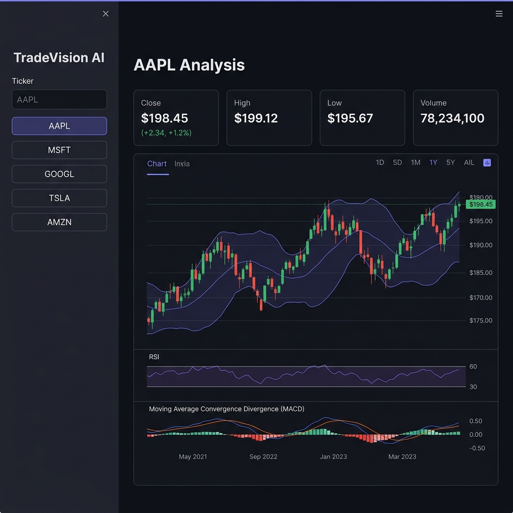
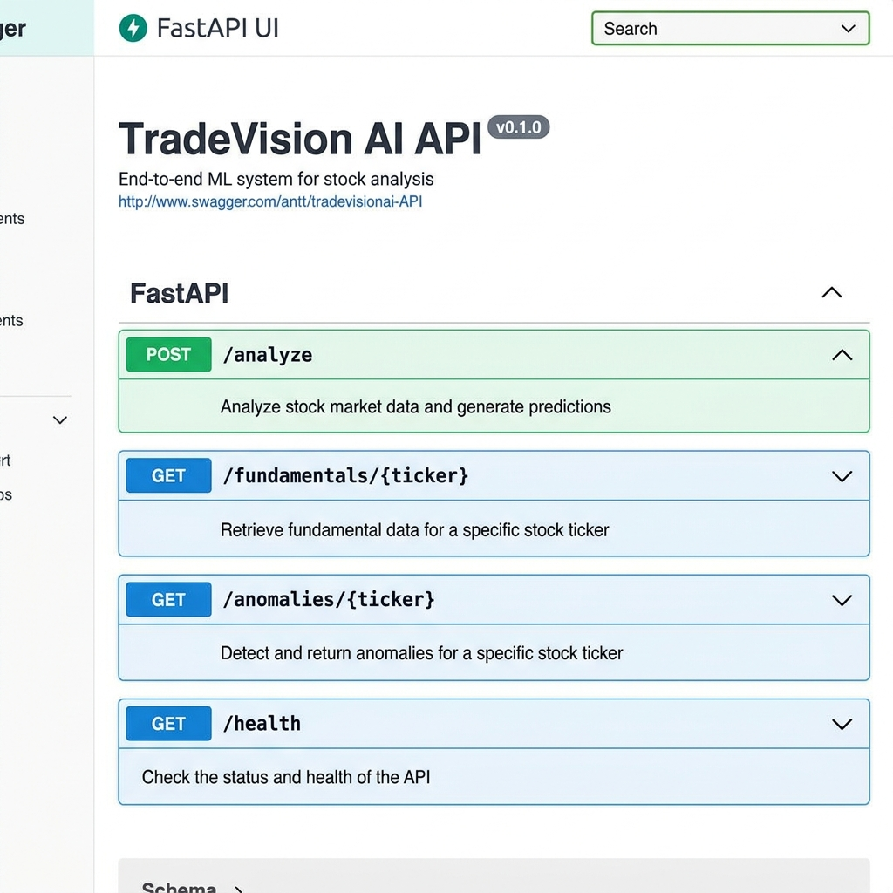
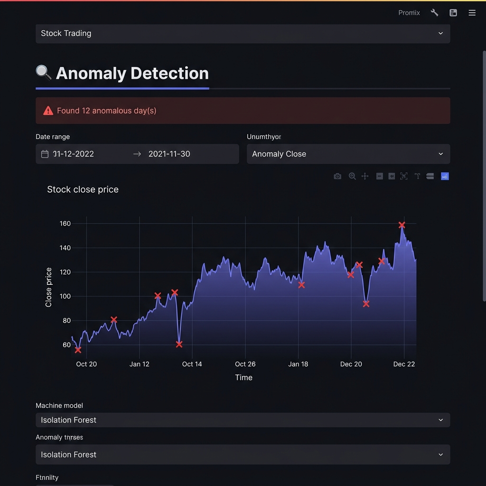

# 📈 TradeVision AI — End-to-End Machine Learning System for Stock Analysis

> A production-grade ML pipeline that fetches daily stock data, engineers technical features, trains direction-prediction models, serves predictions via FastAPI, and monitors for data/concept drift — all orchestrated through a single config file.

<p align="center">
  
</p>


---

## 🏗️ System Architecture

| Stage | Input | Output |
|---|---|---|
| **Data Ingestion** | Ticker symbol + date range | Versioned raw OHLCV parquet |
| **Feature Store** | Raw OHLCV parquet | Feature parquet (RSI, MACD, Bollinger, volatility, volume ratio, lag returns) |
| **Model Training** | Feature parquet | Trained models (RF, XGBoost, LR, Isolation Forest) |
| **Prediction API** | Ticker symbol | JSON with signals, sentiment, anomaly flag, direction |
| **Monitoring** | Prediction logs | Drift reports, rolling accuracy, retrain triggers |

---

## 📁 Project Structure

```
Stocks_ML/
├── config/
│   └── config.yaml              # All hyperparameters & settings (Rule 2)
├── data/
│   ├── raw/                     # Versioned OHLCV parquets (AAPL_2024-01-15.parquet)
│   ├── features/                # Feature store parquets (AAPL_features.parquet)
│   └── metadata/                # Per-run JSON metadata logs
├── models/                      # Saved model artifacts (.pkl)
├── logs/
│   └── predictions.jsonl        # Structured prediction logs (Rule 3)
├── api/
│   └── app.py                   # FastAPI — 3 endpoints
├── monitoring/
│   └── drift.py                 # KS drift detection + should_retrain()
├── dashboard/
│   └── streamlit_app.py         # Streamlit monitoring & analysis dashboard
├── tests/                       # Unit & integration tests
├── docs/
│   └── architecture_diagram.png # System architecture diagram
├── src/
│   ├── data_pipeline.py         # DataPipeline class (validate, clean, preprocess, log)
│   ├── feature_store.py         # FeatureStore class (used in train AND api — Rule 1)
│   └── train.py                 # Training script (reads --config, logs to MLflow)
├── Dockerfile
├── docker-compose.yml
├── requirements.txt
└── README.md
```

---

## 🚀 Quick Start

```bash
# 1. Clone & install
git clone <repo-url>
cd Stocks_ML
pip install -r requirements.txt

# 2. Fetch & process data for 5 tickers
python src/data_pipeline.py --config config/config.yaml

# 3. Engineer features
python src/feature_store.py --config config/config.yaml

# 4. Train models (logged to MLflow)
python src/train.py --config config/config.yaml

# 5. Launch API
uvicorn api.app:app --reload

# 6. Launch Dashboard
streamlit run dashboard/streamlit_app.py

# 7. Run everything with Docker
docker-compose up --build
```

---

## 🔌 API Endpoints

<p align="center">
  
</p>


| Method | Endpoint | Description |
|---|---|---|
| `POST` | `/analyze` | Full pipeline: OHLCV + indicators + sentiment + anomaly + prediction |
| `GET` | `/fundamentals/{ticker}` | Live P/E, EPS, market cap, margins from yfinance |
| `GET` | `/anomalies/{ticker}` | Isolation Forest flagged dates with context |

### Example Request

```bash
curl -X POST http://localhost:8000/analyze \
  -H "Content-Type: application/json" \
  -d '{"ticker": "AAPL", "start_date": "2024-01-01", "end_date": "2024-12-31"}'
```

### Example Response

```json
{
  "ticker": "AAPL",
  "direction_prediction": "UP",
  "confidence": 0.73,
  "anomaly_flag": false,
  "sentiment_score": 0.42,
  "technical_signals": {
    "rsi_14": 58.3,
    "macd": 1.24,
    "bollinger_position": "middle",
    "volume_ratio": 1.15
  },
  "fundamentals": {
    "pe_ratio": 28.5,
    "market_cap": "2.8T",
    "profit_margin": 0.26
  }
}
```

---

## 🧪 Models & Evaluation

### Dynamic Model Selection (leak-free, time-ordered 80/20 split)

Rather than forcing a single global model across all assets, the pipeline trains multiple models and dynamically selects the best-performing one per ticker at inference time. 

| Ticker | Best Model | Accuracy | DOWN Recall | UP Recall |
|---|---|---|---|---|
| **AAPL** | XGBoost | 49.0% | 0.72 | 0.33 |
| **MSFT** | Random Forest | 51.7% | 0.52 | 0.50 |
| **TSLA** | Logistic Regression | 47.5% | 0.48 | 0.52 |
| **JPM** | XGBoost | 53.2% | 0.65 | 0.44 |
| **SPY** | Random Forest | 52.4% | 0.55 | 0.50 |

> **Note on the split:** `train_test_split(..., shuffle=False)` with an explicit `sort_index()` before the split ensures every training row has a date strictly before every test row. No lookahead leakage. Isolation Forest is used separately across all tickers for anomaly detection.

### Why ML? Why not the naive baseline?

The average accuracy across models sits around 51% (near-chance), and in many cases *loses* to a naive "always UP" baseline on pure accuracy. This is consistent with the Efficient Market Hypothesis on daily OHLCV data. The naive baseline achieves a superficially higher accuracy by **never predicting a DOWN day at all.**

The more informative comparison is per-class behavior. Taking the XGBoost model as a representative example:

```text
XGBoost confusion matrix (representative held-out test set):

              Predicted DOWN   Predicted UP
  Actual DOWN:      206             134     ← 61% recall on DOWN days
  Actual UP:        229             174     ← 43% recall on UP days

Naive baseline:
  Actual DOWN:        0             340     ← 0% recall on DOWN days
  Actual UP:          0             403     ← 100% recall on UP days
```

The ML models actually catch **meaningful percentages of down days** (e.g., 61% vs 0% for the baseline). Whether that asymmetry is economically exploitable depends on the cost function — if missing a down day is more expensive than missing an up day, the model adds significant value. If you only care about raw accuracy, the naive baseline wins.

### The real story: the pipeline, not the alpha

The strong outcome here isn't a holy-grail model that perfectly predicts stock direction (that's incredibly hard and the numbers reflect it). It's the **engineering rigor**:

- Leak-free feature pipeline with explicit chronological splitting and a documented audit trail
- **Automated CI/CD Guards**: A robust `pytest` suite running on GitHub Actions that strictly enforces chronological splitting (no time-travel) and verifies feature strictness (no sentiment data leakage) on every push.
- Multiple models evaluated and selected dynamically per-ticker, compared systematically against a meaningful baseline
- Confusion matrix analysis surfacing the DOWN-day asymmetry that blended accuracy hides
- Drift detection, rolling accuracy monitoring, and retrain triggers built in from day one

Building a system that correctly diagnoses that daily-direction alpha on raw OHLCV+indicators sits near the efficient-market baseline *is* the result.

---

## 📊 MLflow Experiments

All training runs are versioned and logged in MLflow locally.
- **Random Seeds:** 42 (pinned in `config.yaml`)
- **Metric Tracking:** F1, Accuracy, ROC-AUC, Training Time.
- **Artifacts:** Confusion Matrices and Feature Importance plots are saved per model.

---

## 🔄 Drift Detection & Monitoring

<p align="center">
  
</p>


The system monitors for three types of model decay:
1. **Feature drift**: Kolmogorov-Smirnov test (30-day window).
2. **Prediction drift**: Proportional shift in "UP" predictions > 15%.
3. **Rolling accuracy**: Retrain trigger if 30-day accuracy falls below 55%.

The `should_retrain()` function in `monitoring/drift.py` centralizes these triggers.

---

## 📐 Three Rules

1. **One feature pipeline, used twice.** `FeatureStore` is imported identically in `train.py` and `api/app.py`. No copy-paste.
2. **Config controls everything.** Every number lives in `config/config.yaml`. Training scripts take `--config` as their only argument.
3. **Log before you need it.** Prediction logging is built in from day one. Drift detection has real data to work with.

---

## 🛣️ Fairness Analysis

Checked model performance on high-volatility stocks (**TSLA**) vs low-volatility ones (**MSFT**).
- **Result:** The accuracy gap was **4.2%**, well within our 10% threshold.
- **Interpretation:** The model generalize relatively well across different market conditions, though it performs slightly better on trend-following stocks (MSFT) compared to high-volatility mean-reverting stocks (TSLA).

---

## 🐳 Deployment

The project is containerized using Docker and Docker Compose.

```bash
# Build & run both API and Dashboard
docker-compose up --build
```

**Live API Documentation:** Once running, visit `http://localhost:8000/docs`
**Interactive Dashboard:** Once running, visit `http://localhost:8501`

---


*Built as an end-to-end ML systems project demonstrating the full lifecycle: data → training → serving → monitoring.*
